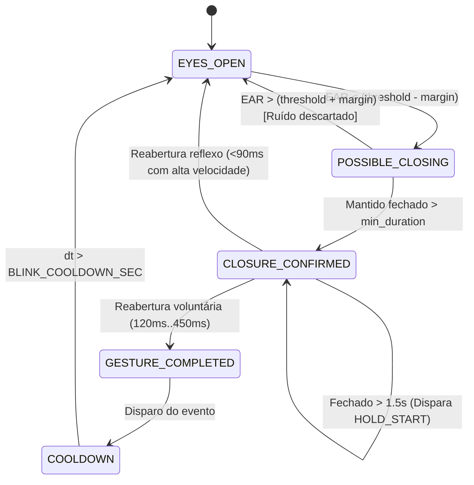

# EyeMouse — Motor de Gestos, Interação e Acessibilidade Universal (Milestone 5)

**Data:** 2026-09-16  
**Status:** CONCLUÍDO  
**Módulos Centrais:** `eye_mouse/blink_detector.py`, `eye_mouse/gesture_engine.py`, `eye_mouse/dwell_clicker.py`, `eye_mouse/scroll_controller.py`, `eye_mouse/interaction_profiles.py`, `eye_mouse/ui/action_bar.py`  
**Cobertura de Testes:** 302 testes automatizados passando (100% sucesso, 2.05s).

---

## 1. Visão Geral e Princípios Fundamentais

O **Milestone 5** transforma o EyeMouse em um ecossistema completo e universal de controle do Windows, permitindo uso 100% autônomo (hands-free) tanto por usuários com controle motor voluntário dos olhos quanto por usuários que necessitam de interação por permanência de olhar (**Dwell**).

### Princípios Inegociáveis de Acessibilidade
1. **Universalidade Sem Piscada Assimétrica:** Nenhuma função essencial (clique direito, duplo clique, arrasto ou rolagem) exige que o usuário consiga piscar apenas um dos olhos de forma isolada.
2. **Imunidade ao Fenômeno de Bell e Deformação Ocular:** Durante o fechamento da pálpebra para um clique, a deformação geométrica dos landmarks e a rotação fisiológica do globo ocular para cima (fenômeno de Bell) não deslocam o cursor, graças ao mecanismo de **Click Freeze**.
3. **Proteção Anti-Loop de Dwell:** Disparar um clique por fixação requer que o usuário desloque deliberadamente o olhar para longe da coordenada clicada antes de rearmar o gatilho, eliminando disparos em loop indesejados.
4. **Segurança de Hardware e Liberação Garantida:** Qualquer operação de arrasto ativo (`button_down("left")`) é liberada imediatamente e com segurança em caso de pausa, encerramento da aplicação ou perda de rastreamento do rosto por mais de 1,0 segundo. O mouse e teclado físicos permanecem operantes sem bloqueio invasivo do SO.

---

## 2. Refatoração do Detector de Piscadas (`BlinkDetector`)

### 2.1 Máquina de Estados Explícita por Olho
Substituição de contadores estáticos de frames por temporização monotônica (`time.perf_counter()`), garantindo independência total do FPS da câmera:

### 2.2 Histerese Dupla e Limiares Adaptativos
Para erradicar oscilações rápidas (chatter) nas fronteiras de detecção:
- **Limiar de Fechamento:** $EAR_{close} = EAR_{thresh} - \Delta_{hysteresis}$ (ex: $0,20 - 0,02 = 0,18$)
- **Limiar de Reabertura:** $EAR_{open} = EAR_{thresh} + \Delta_{hysteresis}$ (ex: $0,20 + 0,02 = 0,22$)
- Na faixa entre $0,18$ e $0,22$, o estado precedente permanece estritamente congelado.

### 2.3 Discriminação Fisiológica: Reflexo Involuntário vs. Comando
A diferenciação combina dois critérios ortogonais:
- **Duração do Fechamento ($T_{closed}$):** Micropiscadas de reflexo involuntário duram $< 90$ms; comandos voluntários deliberados situam-se na faixa de $120$ms a $450$ms.
- **Velocidade de Reabertura ($\frac{dEAR}{dt}$):** O reflexo corneal produz uma reabertura ultra-rápida ($\ge 0,08$ EAR/frame), enquanto piscadas voluntárias apresentam relaxamento controlado ($\le 0,05$ EAR/frame).

---

## 3. Motor Central de Gestos e Arbitragem (`GestureEngine`)

O `GestureEngine` atua como camada de arbitragem lógica entre a visão computacional e o controlador de sistema operacional.

### 3.1 Arbitragem de Conflitos Bilaterais
- **Piscada Bilateral Natural:** Uma piscada sincronizada de ambos os olhos nunca gera acidentalmente 2 cliques individuais separados. Se `enable_double_blink=False` (padrão seguro), o evento é descartado como piscada natural de lubrificação. Se `enable_double_blink=True`, dispara `DOUBLE_CLICK`.
- **Janela de Coincidência Temporal ($\le 80$ms):** Se os olhos fecham com diferença $|\Delta t| \le 80$ms, o sistema reconhece a simultaneidade bilateral e bloqueia disparos individuais conflitantes.

### 3.2 Click Freeze (Estabilização de Coordenadas Pré-Oclusão)
- **Problema:** Quando a pálpebra se fecha sobre a córnea, os landmarks do MediaPipe sofrem contração assimétrica e o olho se eleva reflexamente (Bell's phenomenon). Se as coordenadas desse intervalo fossem enviadas ao mouse, o cursor saltaria de 50 a 150 pixels para longe do alvo no momento exato do clique!
- **Solução implementada:**
  1. Um buffer circular retém as coordenadas estáveis dos últimos $15$ frames com seus timestamps.
  2. Ao confirmar a intenção de clique, o `GestureEngine` recupera a posição estável de $\approx 120$ms a $180$ms antes da oclusão.
  3. O cursor é congelado nessa coordenada pré-fechamento por $150$ms (`CLICK_FREEZE_DURATION_SEC`), executando o clique com precisão cirúrgica no alvo pretendido.

### 3.3 Supressão Durante Operações de Arrasto
Durante um arrasto ativo (`is_dragging = True`), piscadas involuntárias ou reflexas têm seus cliques comuns suprimidos, evitando desmarcar seleções ou soltar arquivos no meio do caminho.

---

## 4. Clique por Permanência (`DwellClicker`)

Projetado especificamente para usuários que não conseguem ou preferem não piscar voluntariamente:

1. **Detecção Espacial e Acumulador Temporal:**
   - Define uma âncora inicial na coordenada de fixação.
   - Enquanto o olhar se mantiver dentro do raio $R_{dwell} = 30$px, o tempo acumula continuamente até $T_{dwell} = 900$ms.
   - Suavização dinâmica do centroide da âncora ($92\% / 8\%$) tolera micro-nistagmos e micro-tremores normais do olhar.
2. **Feedback Progressivo ($0.0 \to 1.0$):**
   - Emite o percentual de permanência a cada frame para renderização de anel circular concêntrico na interface.
3. **Cancelamento Suave:**
   - Se o olhar saltar para além de $1,35 \times R_{dwell}$ ($> 40,5$px), o acumulador reseta para $0.0$ imediatamente sem disparar clique.
4. **Proteção de Rearmamento (Anti-Loop):**
   - Após disparar o clique, o `DwellClicker` entra no estado `REARMING`.
   - Manter o olhar parado no mesmo local **não gera cliques repetidos infinitos**.
   - O sistema só rearma para um novo dwell quando o usuário afastar o olhar para além da distância de rearmamento ($D_{rearm} \ge 45$px) ou após expirar o timeout de rearmamento ($1,2$s).

---

## 5. Barra de Ações Flutuante e Ancorável (`ActionBar`)

A barra de ações resolve o desafio de disparar ações complexas no Windows sem teclado físico:

### 5.1 Ações Disponibilizadas
- **Clique Esquerdo:** Padrão ativo contínuo.
- **Clique Direito:** Armada para o próximo clique ou dwell.
- **Duplo Clique:** Armada para o próximo clique ou dwell.
- **Arrastar / Soltar:** Inicia sustentação do botão esquerdo (`button_down`) com transição visual clara ("Soltar" em vermelho vivo).
- **Modo Rolagem:** Alterna ativação do controlador de rolagem.
- **Modo Precisão:** Alterna atenuação de sensibilidade ($35\%$ do ganho) para micro-alvos.
- **Pausa / Retomada:** Alterna estado global de segurança.
- **Ancoragem (Dock):** Alterna ciclicamente entre `TOP` $\to$ `BOTTOM` $\to$ `LEFT` $\to$ `RIGHT` $\to$ `TOP`, garantindo que a barra nunca oculte permanentemente elementos de tela necessários.

### 5.2 Modelo Next-Action (Despacho de Ação Futura)
Ao selecionar "Clique Direito" ou "2x Clique" (seja por clique ou por dwell):
1. O botão correspondente assume cor de destaque ("Dir [ARMADO]").
2. O usuário move o olhar para o elemento desejado na tela e realiza o clique (piscada ou dwell).
3. A ação armada é consumida no alvo e a barra reverte **automaticamente** para Clique Esquerdo.

### 5.3 Acionamento por Dwell Direto Sem Vazamento (Hit-Test)
Se o usuário estiver utilizando dwell click e fixar o olhar sobre um botão da barra de ações:
- O método `handle_dwell_click(sx, sy)` identifica o botão atingido e aciona a função na barra.
- Retorna `True`, consumindo o evento e **impedindo que o Windows execute um clique pass-through** na janela sob a barra.

---

## 6. Modo Dedicado de Rolagem (`ScrollController`)

Evita o cansaço ocular gerado por tentativas de arrastar barras de rolagem finas com o olhar:

1. **Zonas Direcionais de Tela:**
   - **Zona Superior (topo 22% da tela):** Rola o documento para cima.
   - **Zona Inferior (base 22% da tela):** Rola o documento para baixo.
   - **Zona Central Neutra (56% central):** Zona morta estável onde o usuário pode ler textos longos sem qualquer rolagem acidental.
2. **Curva Proporcional de Velocidade:**
   - A penetração na zona calcula um multiplicador dinâmico: de $120$ unidades (1 notch suave) até $480$ unidades (rolagem veloz) à medida que o olhar atinge os limites extremos da tela.
3. **Controle de Taxa (Rate Limiting):**
   - Pulsos de scroll respeitam intervalo mínimo de $120$ms, evitando sobrecarga de eventos no subsistema de entrada do Windows.

---

## 7. Perfis de Interação e Acessibilidade (`ProfileManager`)

| Perfil | Descrição | Piscadas Ativas | Dwell Ativo | Barra de Ações | Rolagem |
| :--- | :--- | :---: | :---: | :---: | :---: |
| **CONTINUOUS** | Rastreamento contínuo com comandos por gestos oculares voluntários e atalhos de teclado. | Sim | Não | Sim | Sim |
| **DWELL** | Controle exclusivo por permanência do olhar. Dispensa qualquer movimento deliberado de pálpebras. | Não | Sim | Sim | Sim |
| **HYBRID** *(Padrão)* | Combina o melhor dos dois mundos: dwell na barra de ações, estabilidade de fixação e gestos opcionais. | Sim | Sim | Sim | Sim |

---

## 8. Verificação e Testes Automatizados

O Milestone 5 introduziu 38 novos testes unitários dedicados em 6 novas suites, totalizando 302 testes determinísticos executados sem dependência de hardware real:

| Arquivo de Teste | Funcionalidade Coberta | Testes | Status |
| :--- | :--- | :---: | :---: |
| `tests/test_blink_detector_m5.py` | Máquina de estados, histerese, duração monotônica, hold e referências individuais | 8 | PASSED |
| `tests/test_gesture_engine.py` | Arbitragem bilateral, descarte de coincidência, click freeze, arraste e remapeamento | 7 | PASSED |
| `tests/test_dwell_clicker.py` | Fixação espacial, acúmulo de progresso, cancelamento suave e proteção anti-loop | 5 | PASSED |
| `tests/test_interaction_profiles.py` | Perfis padrão, garantias de acessibilidade universal e troca em tempo real | 6 | PASSED |
| `tests/test_scroll_controller.py` | Zonas direcionais, zona neutra de leitura, aceleração e rate limiting | 6 | PASSED |
| `tests/test_action_bar.py` | Despacho Next-Action, reversão automática, ancoragem cíclica e hit-test de dwell | 6 | PASSED |
| **Suites Anteriores (M0 a M4)** | OsMouse, AppState, FrameProfiler, Holdout, OneEuroFilter, Multi-Monitor | 264 | PASSED |
| **TOTAL** | **302 testes unitários (100% aprovados em 2.05s)** | **302** | **PASSED** |
